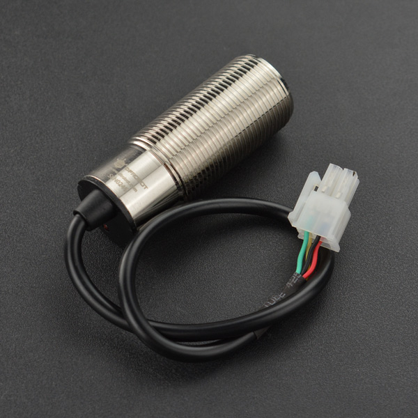
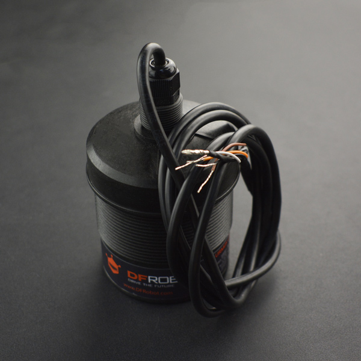
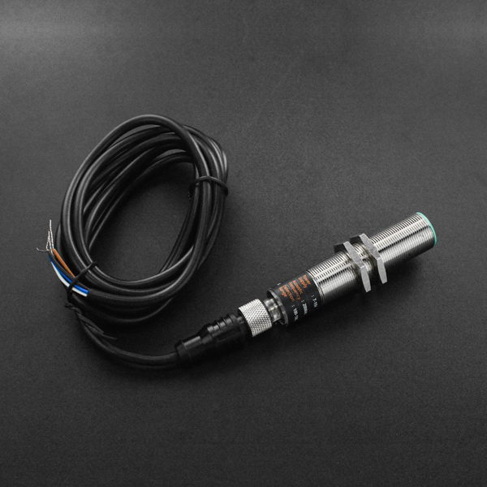
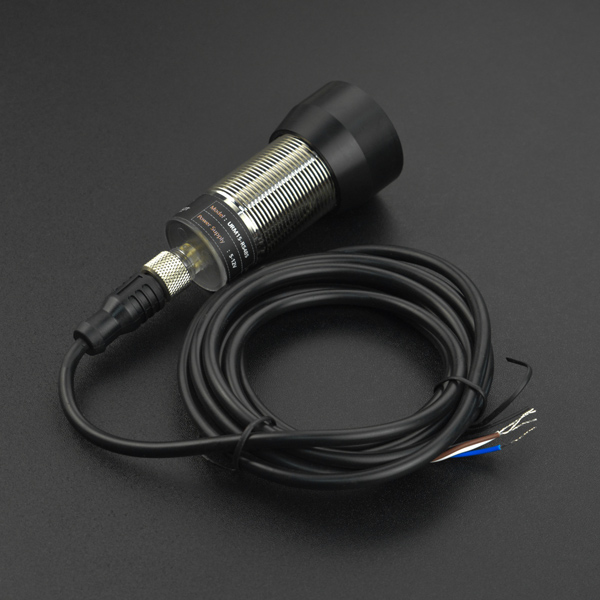

# DFRobot_URMXX
* [中文版](./README_CN.md)

URM08 is DFRobot's new generation of waterproof ultrasonic sensor, possessing both temperature and distance detection as its main features. It has internal temperature compensation, allowing for accurate detection of the distance between the sensor and the target object. The sensor is fully sealed internally, with a metal material shell, offering advantages such as waterproofing, dustproofing, and corrosion resistance. It can be applied to various level detections and barrier applications. The sensor adopts high-standard component selection, maintaining a short detection blind zone and a large distance detection range even in single probe situations.



URM12 has a distance measurement range of up to 1500CM and a ranging frequency of 3Hz. It is an ultrasonic sensor designed by DFRobot mainly for large-scale distance measurement applications. It uses the RS485 communication interface and standard Modbus-RTU communication protocol, with only a 15° detection angle, suitable for level detection or robot obstacle avoidance applications.



URM14 sensor integrates advanced automatic noise detection function. The sensor can detect noise in real-time and dynamically adjust sensor parameters based on the noise level. Moreover, the sensor has a flexible temperature compensation function. Users can configure the use of internal temperature compensation or external temperature compensation functions according to actual application scenarios, making the sensor suitable for various complex application scenarios.



URM15 is a single-probe ultrasonic ranging sensor with IP65 waterproof rating. It uses the RS485 communication interface with standard ModbusRTU protocol, offering high communication reliability. The effective distance for flat wall distance measurement is 30cm-500cm. Moreover, the sensor's slave address and serial parameters can be modified according to the actual situation, so it can be quickly and conveniently connected to various industrial control hosts. The sensor has a flexible temperature compensation function. Users can choose external temperature compensation or onboard temperature compensation function according to actual needs to avoid the significant impact of environmental temperature on measurement results. The sensor uses a 75Khz ultrasonic transducer, which has a diameter of about 40mm. Therefore, the main feature of this sensor is that it has high sensitivity and a smaller detection angle while maintaining high sensitivity.




## Product Link (www.dfrobot.com)
    SKU: SEN0246 SEN0310 SEN0358 SEN0519
    URM08_SEN0246 : https://www.dfrobot.com/product-1913.html
    URM12_SEN0310 : https://www.dfrobot.com/product-2059.html
    URM14_SEN0358 : https://www.dfrobot.com/product-2173.html
    URM15_SEN0519 : https://www.dfrobot.com/product-2620.html


## Table of Contents

* [Summary](#summary)
* [Installation](#installation)
* [Methods](#methods)
* [Compatibility](#compatibility)
* [History](#history)
* [Credits](#credits)


## Summary

The library uses the RTU communication protocol and relies on the DFRobot_RTU library. If you want to install and run the library you have to install its dependent libraries.


## Installation

There two methods: 
1. To use this library, first download the library file(https://github.com/DFRobot/DFRobot_URMXX) and dependent file(https://github.com/DFRobot/DFRobot_RTU), paste it into the \Arduino\libraries directory, then open the examples folder and run the demo in the folder.
2. Search the DFRobot_URMXX and DFRobot_RTU library from the Arduino Software Library Manager and download it.


## Methods

```C++

  /**
   * @fn begin
   * @brief Init function
   * @param _serial Serial ports for communication, supporting hard and soft serial ports
   * @return int type, means returning initialization status
   * @retval 0 NO_ERROR
   * @retval -1 ERR_DATA_BUS
   * @retval -2 ERR_IC_VERSION
   */
  int begin(Stream *_serial);

  /**
   * @fn getDistanceRaw
   * @brief Get distance measurement data
   * @return Returns 16 bits of distance data
   * @n URM08 : U: 1 cm, R: 35~550 cm, F: 38~42KHz, DC: 6~12 V, T: 1000/10 ms
   * @n URM12 : U: 1 cm, R: 70~1500 cm, F: 38~42KHz, DC: 9~24 V, T: 1000/3 ms
   * @n URM14 : U: 0.1 mm, R: 100~1500 mm, F: 200±4KHz, DC: 7~15 V, T: 1000/30 ms
   * @n URM15 : U: 0.1 cm, R: 30~500 cm, F: 75±2KHz, DC: 5~12 V, T: 1000/10ms
   */
  uint16_t getDistanceRaw(void);

  /**
   * @fn getTemperatureC
   * @brief Obtain temperature measurement data
   * @return Returns floating point temperature data in degrees Celsius
   * @note Unit: 0.1 °C, Range: -10~70 °C, Deviation: ±1 °C
   */
  float getTemperatureC(void);

  /**
   * @fn refreshBasicInfo
   * @brief Get and store basic information
   * @details After obtaining it, you can view it using the structure variable basicInfo
   *    typedef struct
   *    {
   *      uint16_t VID;   // module VID, the default value is 0x3343 (represent manufacturer DFRobot)
   *      uint16_t PID;   // module PID, corresponding product model
   *      uint16_t HARD_V;   // hardware revision number: 0x1000 represents V1.0.0.0
   *      uint16_t SOFT_V;   // software revision number: 0x1000 represents V1.0.0.0
   *      uint16_t modbusAddr;   // module communication address, module device address(1~247)
   *      uint16_t baudrate;   // module baud rate, the default value is 0x0009(1000000)
   *      uint8_t stopbit;   // stop bit: 0.5bit; 1bit; 1.5bit; 2bit
   *      uint8_t checkbit;   // check bit: 0 represents none; 1 represents even; 2 represents odd
   *    }sBasicInfo_t;
   * @return uint8_t, Exception code:
   * @retval   0 : sucess.
   * @retval   1 or eRTU_EXCEPTION_ILLEGAL_FUNCTION : Illegal function.
   * @retval   2 or eRTU_EXCEPTION_ILLEGAL_DATA_ADDRESS: Illegal data address.
   * @retval   3 or eRTU_EXCEPTION_ILLEGAL_DATA_VALUE:  Illegal data value.
   * @retval   4 or eRTU_EXCEPTION_SLAVE_FAILURE:  Slave failure.
   * @retval   8 or eRTU_EXCEPTION_CRC_ERROR:  CRC check error.
   * @retval   9 or eRTU_RECV_ERROR:  Receive packet error.
   * @retval   10 or eRTU_MEMORY_ERROR: Memory error.
   * @retval   11 or eRTU_ID_ERROR: Broadcasr address or error ID
   */
  uint8_t refreshBasicInfo(void);

  /**
   * @fn setADDR
   * @brief Set the module communication address
   * @param addr Device address to be set, (1~247 for 0x0001~0x00F7)
   * @return None
   */
  void setADDR(uint16_t addr);

  /**
   * @fn setBaudrateMode
   * @brief Set the module baud rate, the setting takes effect after power fail and restart
   * @param mode The baud rate to be set:
   * @n     eBaudrate2400---2400, eBaudrate4800---4800, eBaudrate9600---9600, 
   * @n     eBaudrate14400---14400, eBaudrate19200---19200, eBaudrate38400---38400, 
   * @n     eBaudrate57600---57600, eBaudrate115200---115200, eBaudrate_1000000---1000000
   */
  void setBaudrateMode(eBaudrateMode_t mode);

  /**
   * @fn setCheckbitStopbit
   * @brief Set check bit and stop bit of the module
   * @param mode The mode to be set, perform OR operation on the following to get mode::
   * @n     check bit:
   * @n           eCheckBitNone
   * @n           eCheckBitEven
   * @n           eCheckBitOdd
   * @n     stop bit:
   * @n           eStopBit1
   * @n           eStopBit2
   */
  void setCheckbitStopbit(uint16_t mode);

/***************** Except URM08 ******************************/

  /**
   * @fn setExternalTemperatureC
   * @brief The user writes the temperature for the external compensation function
   * @return None
   */
  virtual void setExternalTemperatureC(float temp);

  /**
   * @fn getExternalTemperatureC
   * @brief Gets the external compensation temperature of the current write
   * @return Returns floating point temperature data in degrees Celsius
   */
  virtual float getExternalTemperatureC(void);

  /**
   * @fn setControlRegister
   * @brief Configuration control register
   * @param mode sURMXXConfig_t:
   * @n       mode.tempCompSource : eInternalTemp: Use onboard temperature compensation,  eExternalTemp: Use external temperature compensation work
   * @n                             (requires user to write temperature data to external temperature compensation data register)
   * @n       mode.tempCompMode : eTempCompEN: enable temperature compensation,  eTempCompDIS: disable temperature compensation
   * @n       mode.autoMeasureMode : eAutoMeasureMode: auto measuring distance,  ePassiveMeasureMode: passive measuring distance
   * @n       mode.trigPasvMeasure : In passive mode, write 1 to the bit and the sensor will complete a distance measurement (about 300ms).
   * @n       mode.reserved : reserved bit
   * @return None
   */
  virtual void setControlRegister(sURMXXConfig_t mode);

  /**
   * @fn getControlRegister
   * @brief Gets the current control register value
   * @return sURMXXConfig_t:
   * @n       return.tempCompSource : eInternalTemp: Use onboard temperature compensation,  eExternalTemp: Use external temperature compensation work
   * @n                               (requires user to write temperature data to external temperature compensation data register)
   * @n       return.tempCompMode : eTempCompEN: enable temperature compensation,  eTempCompDIS: disable temperature compensation
   * @n       return.autoMeasureMode : eAutoMeasureMode: auto measuring distance,  ePassiveMeasureMode: passive measuring distance
   * @n       return.trigPasvMeasure : In passive mode, write 1(eTrigPassiveMeasure) to the bit and the sensor will complete a distance measurement (about 300ms).
   * @n       return.reserved : reserved bit
   */
  virtual sURMXXConfig_t getControlRegister(void);

/***************** Only URM14 ******************************/

  /**
   * @fn getNoiseLevel
   * @brief Get the power supply noise level
   * @details This parameter reflects the degree of influence of the power supply and environment on the sensor.
   * @n The smaller the noise level, the more accurate the distance value obtained by the sensor.
   * @return uint8_t 0x00-0x0A corresponds to noise levels 0-10.
   */
  virtual uint8_t getNoiseLevel(void);

```


## Compatibility

* DFRobot_RTU

MCU                | SoftwareSerial | HardwareSerial |
------------------ | :------------: | :------------: |
Arduino Uno        |       √        |                |
Mega2560           |       √        |       √        |
Leonardo           |       √        |       √        |
ESP32              |                |       √        |
ESP8266            |       √        |                |
micro:bit          |                |                |
FireBeetle M0      |                |       √        |

* DFRobot_URMXX

MCU                | Work Well    | Work Wrong   |  Untested   | Remarks
------------------ | :----------: | :----------: | :---------: | :---:
Arduino Uno        |      √       |              |             |
Arduino MEGA2560   |      √       |              |             |
Arduino Leonardo   |      √       |              |             |
FireBeetle-ESP8266 |      √       |              |             |
FireBeetle-ESP32   |      √       |              |             |
FireBeetle-M0      |      √       |              |             |


## History

- 2023/10/18 - Version 1.0.0 released.


## Credits

Written by qsjhyy(yihuan.huang@dfrobot.com), 2023. (Welcome to our [website](https://www.dfrobot.com/))

