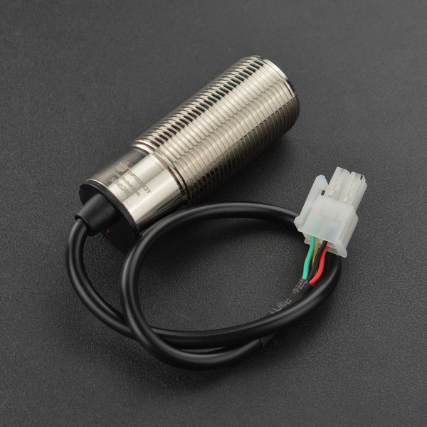
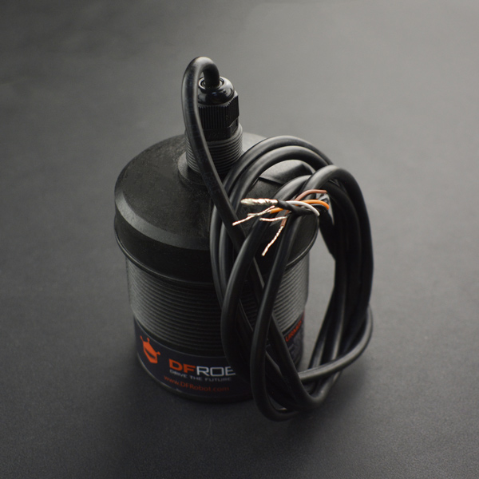
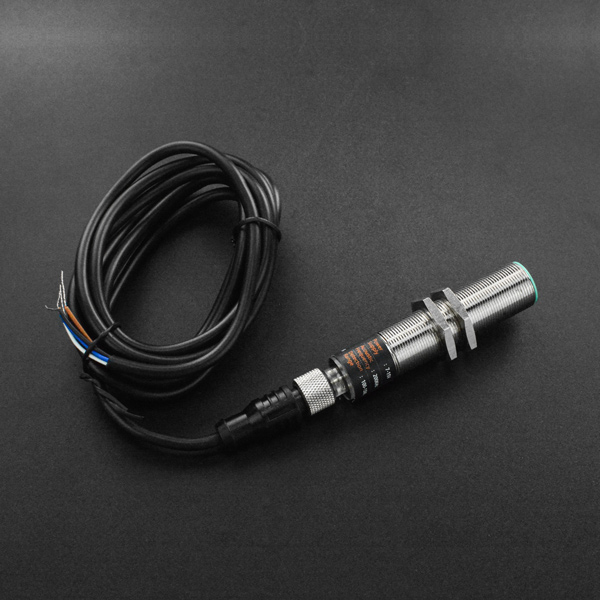

# DFRobot_URMXX
* [English Version](./README.md)

URM08是DFRobot新一代的防水型超声波传感器，兼具温度和距离检测两大主要功能，具有内部温度补偿，可准确检测传感器与目标物之间的距离。传感器内部完全密封，采用金属材质外壳，具有防水、防尘、耐腐蚀等优点，可应于各种液位、物位检测及各种壁障应用。传感器采用高标准器件选型，单探头的情况下依旧具有较短的检测盲区及较大的距离检测范围。



URM12具有高达1500CM的测距范围，测距频率3Hz，它是DFRobot主要针对大量程测距应用设计的超声波传感器，它采用RS485通信接口及标准Modbus-RTU通信协议，具有仅15°的探测角度，适用于液位物位检测或机器人避障等应用。



URM14传感器集成了先进的自动噪声检测功能，传感器能够实时检测噪声并能根据噪声等级动态调节传感器参数，另外，传感器具有灵活的温度补偿功能，用户可以根据实际应用场景配置使用传感器内部温度补偿或外加温度补偿的功能，这都使得传感器能够适用于各种复杂的应用场景。



URM15是一款具有IP65级防水型单探头超声波测距传感器，采用标准ModbusRTU协议的RS485通信接口，具有高度的通信可靠性。测距平整墙面有效距离为30cm-500cm。并且传感器的从机地址及串口参数都可以根据实际情况作修改，因此可以方便快速的连接到各种工控主机，非常方便上手使用。该传感器具有灵活的温度补偿功能，用户可以根据实际需求选择外部温度补偿或板载温度补偿功能来避免环境温度对测量结果造成的较大影响。该传感器使用的是频率为75Khz的超声波换能器，该换能器直径约为40mm。因此这款传感器的主要特点是在具有较高灵敏度的同时，探测角度也比较小。


## 产品链接 (www.dfrobot.com.cn)
    SKU: SEN0246 SEN0310 SEN0358 SEN0519
    URM08_SEN0246 : https://www.dfrobot.com.cn/goods-2015.html
    URM12_SEN0310 : https://www.dfrobot.com.cn/goods-2816.html
    URM14_SEN0358 : https://www.dfrobot.com.cn/goods-2981.html
    URM15_SEN0519 : https://www.dfrobot.com.cn/goods-3593.html


## 目录

* [概述](#概述)
* [库安装](#库安装)
* [方法](#方法)
* [兼容性](#兼容性)
* [历史](#历史)
* [创作者](#创作者)


## 概述

这个库用使用RTU通信协议, 依赖于DFRobot_RTU这个库, 安装运行此库必须安装他的依赖库。


## 库安装

这里有2种安装方法：
1. 使用此库前, 请首先下载库文件( https://github.com/DFRobot/DFRobot_URMXX )和依赖文件( https://github.com/DFRobot/DFRobot_RTU ), 将其粘贴到\Arduino\libraries目录中, 然后打开examples文件夹并在该文件夹中运行演示。
2. 直接在Arduino软件库管理中搜索下载 DFRobot_URMXX 和 DFRobot_RTU 库。


## 方法

```C++

  /**
   * @fn begin
   * @brief 初始化函数
   * @param _serial 通信所需串口, 支持硬串口和软串口
   * @return int类型, 表示返回初始化的状态
   * @retval 0 NO_ERROR
   * @retval -1 ERR_DATA_BUS
   * @retval -2 ERR_IC_VERSION
   */
  int begin(Stream *_serial);
  /**
   * @fn getDistanceRaw
   * @brief 获取距离测量数据
   * @return 返回16位距离数据
   * @n URM08：U：1厘米，R：35~550厘米，F：38~42KHz，DC：6~12 V，T：1000/10毫秒
   * @n URM12：U：1厘米，R：70~1500厘米，F：38~42KHz，DC：9~24 V，T：1000/3毫秒
   * @n URM14：U：0.1毫米，R：100~1500毫米，F：200±4KHz，DC：7~15 V，T：1000/30毫秒
   * @n URM15：U：0.1厘米，R：30~500厘米，F：75±2KHz，DC：5~12 V，T：1000/10毫秒
   */
  uint16_t getDistanceRaw(void);

  /**
   * @fn getTemperatureC
   * @brief 获取温度测量数据
   * @return 返回摄氏度浮点温度数据
   * @note 单位：0.1°C，范围：-10~70°C，偏差：±1°C
   */
  float getTemperatureC(void);

  /**
   * @fn refreshBasicInfo
   * @brief 获取并存储基本信息
   * @details 获取后，您可以使用结构变量basicInfo查看
   *    typedef struct
   *    {
   *      uint16_t VID;   // 模块VID，默认值为0x3343（代表制造商DFRobot）
   *      uint16_t PID;   // 模块PID，对应产品型号
   *      uint16_t HARD_V;   // 硬件版本号：0x1000代表V1.0.0.0
   *      uint16_t SOFT_V;   // 软件版本号：0x1000代表V1.0.0.0
   *      uint16_t modbusAddr;   // 模块通信地址，模块设备地址（1~247）
   *      uint16_t baudrate;   // 模块波特率，默认值为0x0009（1000000）
   *      uint8_t stopbit;   // 停止位：0.5位；1位；1.5位；2位
   *      uint8_t checkbit;   // 校验位：0表示无；1表示偶数；2表示奇数
   *    }sBasicInfo_t;
   * @return uint8_t，异常代码：
   * @retval   0：成功。
   * @retval   1或eRTU_EXCEPTION_ILLEGAL_FUNCTION：非法功能。
   * @retval   2或eRTU_EXCEPTION_ILLEGAL_DATA_ADDRESS：非法数据地址。
   * @retval   3或eRTU_EXCEPTION_ILLEGAL_DATA_VALUE：非法数据值。
   * @retval   4或eRTU_EXCEPTION_SLAVE_FAILURE：从机故障。
   * @retval   8或eRTU_EXCEPTION_CRC_ERROR：CRC校验错误。
   * @retval   9或eRTU_RECV_ERROR：接收数据包错误。
   * @retval   10或eRTU_MEMORY_ERROR：内存错误。
   * @retval   11或eRTU_ID_ERROR：广播地址或错误ID。
   */
  uint8_t refreshBasicInfo(void);

  /**
   * @fn setADDR
   * @brief 设置模块的通信地址
   * @param addr 要设置的设备地址, (1~247即0x0001~0x00F7)
   * @return None
   */
  void setADDR(uint16_t addr);

  /**
   * @fn setBaudrateMode
   * @brief 设置模块的波特率, 掉电重启后生效
   * @param mode 要设置的波特率:
   * @n     eBaudrate2400---2400, eBaudrate4800---4800, eBaudrate9600---9600, 
   * @n     eBaudrate14400---14400, eBaudrate19200---19200, eBaudrate38400---38400, 
   * @n     eBaudrate57600---57600, eBaudrate115200---115200, eBaudrate_1000000---1000000
   */
  void setBaudrateMode(eBaudrateMode_t mode);

  /**
   * @fn setCheckbitStopbit
   * @brief 设置模块的校验位和停止位
   * @param mode 要设置的模式, 下列模式经过或运算后得到mode:
   * @n     校验位:
   * @n           eCheckBitNone
   * @n           eCheckBitEven
   * @n           eCheckBitOdd
   * @n     停止位:
   * @n           eStopBit1
   * @n           eStopBit2
   */
  void setCheckbitStopbit(uint16_t mode);

/***************** 除 URM08 以外的模块适用的api ******************************/
  /**
   * @fn setExternalTemperatureC
   * @brief 用户写入外部补偿温度的函数
   * @return 无
   */
  virtual void setExternalTemperatureC(float temp);

  /**
   * @fn getExternalTemperatureC
   * @brief 获取当前写入的外部补偿温度
   * @return 返回以摄氏度为单位的浮点温度数据
   */
  virtual float getExternalTemperatureC(void);

  /**
   * @fn setControlRegister
   * @brief 配置控制寄存器
   * @param mode sURMXXConfig_t：
   * @n       mode.tempCompSource : eInternalTemp: 使用板载温度补偿， eExternalTemp: 使用外部温度补偿工作
   * @n                             (需要用户将温度数据写入外部温度补偿数据寄存器)
   * @n       mode.tempCompMode : eTempCompEN: 启用温度补偿， eTempCompDIS: 禁用温度补偿
   * @n       mode.autoMeasureMode : eAutoMeasureMode: 自动测距， ePassiveMeasureMode: 被动测距
   * @n       mode.trigPasvMeasure : 在被动模式下，将1写入该位，传感器将完成一次测距（约300毫秒）。
   * @n       mode.reserved : 保留位
   * @return 无
   */
  virtual void setControlRegister(sURMXXConfig_t mode);

  /**
   * @fn getControlRegister
   * @brief 获取当前控制寄存器的值
   * @return sURMXXConfig_t：
   * @n       return.tempCompSource : eInternalTemp: 使用板载温度补偿， eExternalTemp: 使用外部温度补偿工作
   * @n                               (需要用户将温度数据写入外部温度补偿数据寄存器)
   * @n       return.tempCompMode : eTempCompEN: 启用温度补偿， eTempCompDIS: 禁用温度补偿
   * @n       return.autoMeasureMode : eAutoMeasureMode: 自动测距， ePassiveMeasureMode: 被动测距
   * @n       return.trigPasvMeasure : 在被动模式下，将1（eTrigPassiveMeasure）写入该位，传感器将完成一次测距（约300毫秒）。
   * @n       return.reserved : 保留位
   */
  virtual sURMXXConfig_t getControlRegister(void);

/***************** 仅适用于 URM14 ******************************/

  /**
   * @fn getNoiseLevel
   * @brief 获取电源噪声等级
   * @details 该参数能够反映供电电源以及环境对传感器的影响程度。
   * @n 噪声等级越小，传感器得到的距离值将更精准。
   * @return uint8_t 0x00-0x0A对应噪声等级0-10
   */
  virtual uint8_t getNoiseLevel(void);

```


## 兼容性

* DFRobot_RTU

MCU                | SoftwareSerial | HardwareSerial |
------------------ | :------------: | :------------: |
Arduino Uno        |       √        |                |
Mega2560           |       √        |       √        |
Leonardo           |       √        |       √        |
ESP32              |                |       √        |
ESP8266            |       √        |                |
micro:bit          |                |                |
FireBeetle M0      |                |       √        |

* DFRobot_URMXX

MCU                |  Work Well   |  Work Wrong  |  Untested   | Remarks
------------------ | :----------: | :----------: | :---------: | :---:
Arduino Uno        |      √       |              |             |
Arduino MEGA2560   |      √       |              |             |
Arduino Leonardo   |      √       |              |             |
FireBeetle-ESP8266 |      √       |              |             |
FireBeetle-ESP32   |      √       |              |             |
FireBeetle-M0      |      √       |              |             |


## 历史

- 2023/10/18 - 1.0.0 版本


## 创作者

Written by qsjhyy(yihuan.huang@dfrobot.com), 2023. (Welcome to our [website](https://www.dfrobot.com/))

